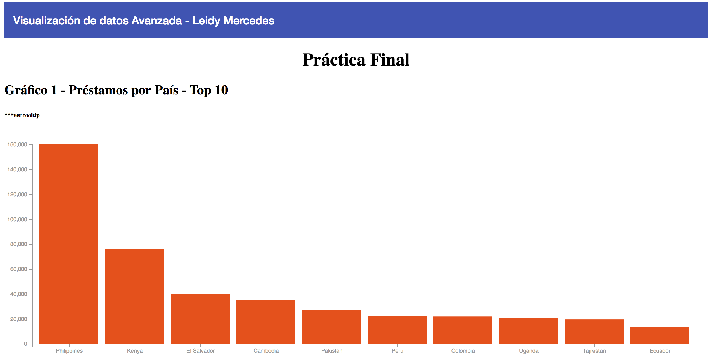

# Práctica Final Visualización Avanzada de Datos

This project was generated with [Angular CLI](https://github.com/angular/angular-cli) version 1.7.4.

## Instrucciones

## API Server

Se requiere NODE JS 
El servidor se encuentra en la ruta ~/server/server.js

Ejecutar  ` node server.js ` para subir el API REST. Este servidor está configurado para escuchar en el puerto 3002.

## Dependencias en API SERVER

Este servidor tiene las siguientes dependencias:

express
cors
fs - Utilizado para leer los archivos JSON
underscore - Utilizado para filtrar archivos JSON

## Development server

Ejecutar `ng serve` /  `npm start` para subir el servidor de desarrollo. Navegar a `http://localhost:4200/`. 

## Aplicacióm

## Ayuda

Luego de ejecutar las instrucciones anteriores, usted debe ser la aplicación corriendo perfectamente.

Por motivos de computadoras locales, puede verse en la necesidad de ejecutar nuevamente el package.json. Ejecutar `install package.json` en caso de que lo necesite.

